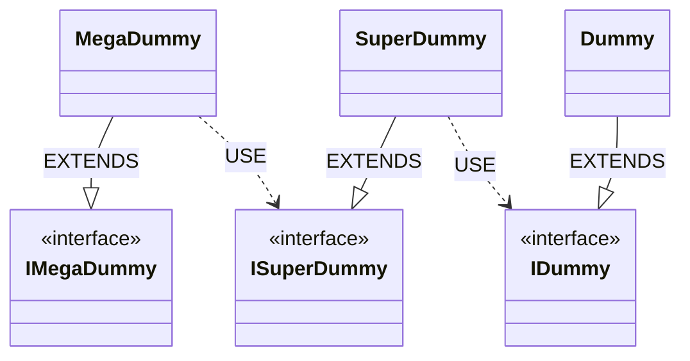

# Investigation about: Autodesk/goatnative-inject repository

- [Autodesk/goatnative-inject](https://github.com/Autodesk/goatnative-inject)

## Example

```mermaid
classDiagram

class IDummy{
    <<interface>>
}

class ISuperDummy {
    <<interface>>
}

class IMegaDummy{
    <<interface>>
}

MegaDummy --|> IMegaDummy : EXTENDS

MegaDummy ..> ISuperDummy : USE
SuperDummy --|> ISuperDummy : EXTENDS

SuperDummy ..> IDummy : USE
Dummy --|> IDummy : EXTENDS
```
