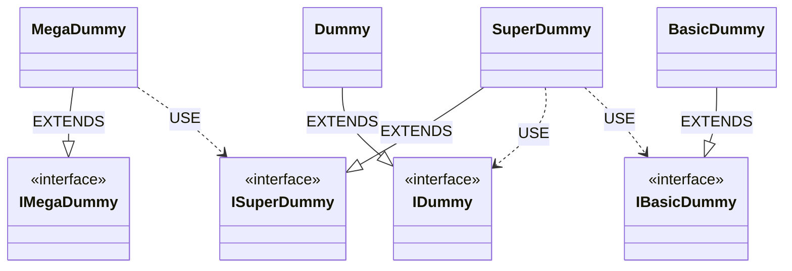
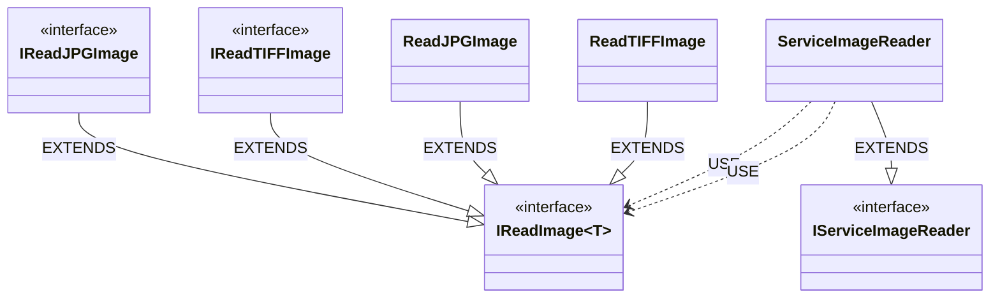

# Investigation about: Autodesk/goatnative-inject repository

Investigation about a found link for (IoC - inversion of control) and build a injector container. It´s looks works fine!

- [Autodesk/goatnative-inject](https://github.com/Autodesk/goatnative-inject)

## A. How to build example, building a console executable.

```
g++ -std=c++20 main.cpp -o main
```

## B. Examples

### B.1. Example with several levels of dependencies.



### B.2. Example with several levels of dependencies and templates.



## C. Useful links to design graphs based on Mermaid syntax and IoC concepts.

- [Mermaid - Class diagrams](https://mermaid.js.org/syntax/classDiagram.html)
- [Mermaid - Online designer](https://mermaid.live)
- [UML Class Diagram Relationships Explained with Examples](https://creately.com/guides/class-diagram-relationships/)
- [Dependency Inversion Implies Interfaces Are Owned by High-level Modules](https://mikhail.io/2016/05/dependency-inversion-implies-interfaces-are-owned-by-high-level-modules/)