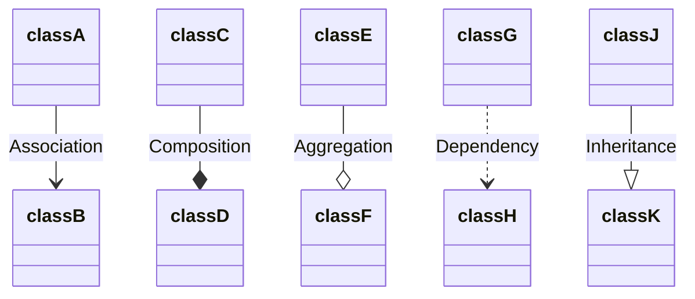
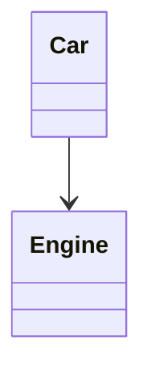

# Relationships between classes applied in C++ language with UML.

## A. Relationships between classes

1. Association (knows a)
2. Composition (has a)
3. Aggregation (has a)
4. Dependency (uses a)
5. Inheritance (is a)

Examples using [mermaid](https://mermaid.js.org/intro/) Markdown.



### A.1. Association

Un objeto es consciente de otro. Contiene un puntero o referencia a otro objeto.

- Code example:

```
class Engine
{

};

class Car 
{
    private:
        Engine* _engine;
    public:
        Car(Engine* engine) : _engine (engine){}
};

int main()
{
    Car car(new Engine());
    
    return 0;
}
```

- Diagram exmaple



### A.2. Composition

- Code example:

```
// TODO
```

### A.3. Aggregation

- Code example:

```
// TODO
```

### A.4. Dependency

- Code example:

```
// TODO
```

### A.5. Inheritance

- Code example:

```
// TODO
```

## Useful links with information.

- [creately: UML Class Diagram Relationships Explained with Examples](https://creately.com/guides/class-diagram-relationships/)