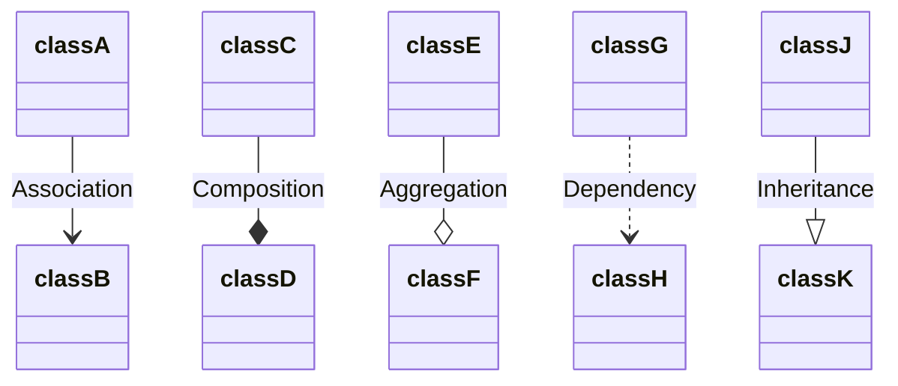
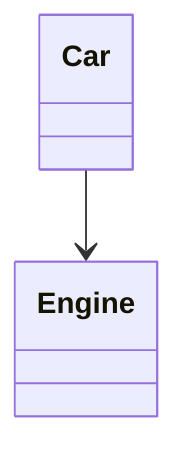
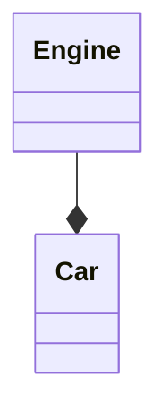
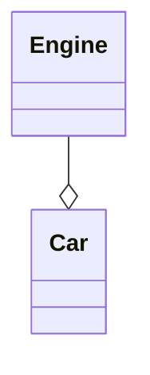
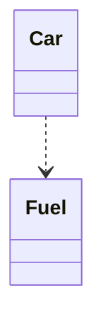

# Relationships between classes applied in C++ language with UML.

## A. Relationships between classes

1. Association (knows a)
2. Composition (has a)
3. Aggregation (has a)
4. Dependency (uses a)
5. Inheritance (is a)

Examples using [mermaid](https://mermaid.js.org/intro/) Markdown.



### A.1. Association

- Un objeto es consciente de otro. Contiene un puntero o referencia a otro objeto (isntancia).

- Code example:

```
class Engine
{

};

class Car
{
    public:
        void start_engine(Engine* engine){}
};

int main()
{
    Engine* engine = new Engine();
    Car car;
    car.start_engine(engine);
    
    return 0;
}
```

- Diagram exmaple



### A.2. Composition

- Una clase forma parte de la otra.
- No se pueden agregar partes después de su creación.

- Code example:

```
class Engine
{
public:
    void turn_on() 
    {
        // Logic to turn on engine.
    }
};

class Car
{
    private:
        Engine* _engine;
    public:
        Car()
        {
            _engine = new Engine();
        }
        ~Car()
        {
            delete _engine;
        }
        void start_engine()
        {
            _engine->turn_on();
        }
};

int main()
{
    Car car;
    car.start_engine();
    
    return 0;
}
```

- Diagram example:



### A.3. Aggregation

- Grado de dependencia bajo.
- Una clase no forma parte de la otra, puede vivir independientemente.
- Capacidad de agregar más elementos.
- Puede ser no destruído cuando lo hace la clase contenedora.
- 

- Code example:

```
#include <vector>

class Engine
{

};

class Car
{
    private:
        Engine* _engine;

    public:
        Car(){}
        ~Car(){ delete _engine; }
        void add_engine(Engine* engine)
        {
            _engine = engine;
        }
};

int main()
{
    Engine* renault_engine = new Engine();
    Engine* mercedes_engine = new Engine();

    Car mercedes;
    mercedes.add_engine(renault_engine);

    // more logic... and engine change!

    mercedes.add_engine(mercedes_engine);

    delete renault_engine;
    delete mercedes_engine;
    
    return 0;
}
```

- Diagram example:



### A.4. Dependency

- Una clase depende de otra. Un cambio en una, proboca un cambio en la otra.
- Una dependencia es una relación "de uso", en el ejemplo, *Car* depende de *Fuel*. Si no hay fuel, no podrá inicar la marcha.

- Code example:

```
class Fuel
{
    private:
};

class Car
{
private:

public:

    Car(){}
    void before_start(Fuel *fuel)
    {
        // Logic
    }
};

int main()
{
    Car car;
    Fuel* fuel = new Fuel();

    car.before_start(fuel);

    delete fuel;

    return 0;
}
```
- Diagram example:



### A.5. Inheritance

- También es conocida cómo generalización.

- Code example:

```
// TODO
```

## B. Useful links with information.

- [creately: UML Class Diagram Relationships Explained with Examples](https://creately.com/guides/class-diagram-relationships/)

- [blog.visual-paradigm: ¿Cuáles Son Los Seis Tipos De Relaciones En Los Diagramas De Clases UML?](https://blog.visual-paradigm.com/es/what-are-the-six-types-of-relationships-in-uml-class-diagrams/)